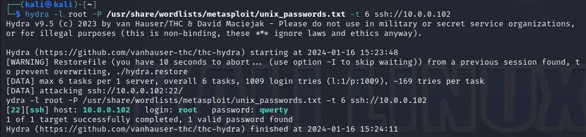
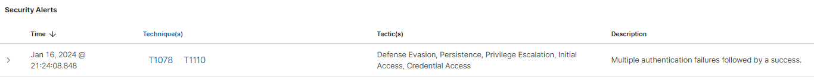
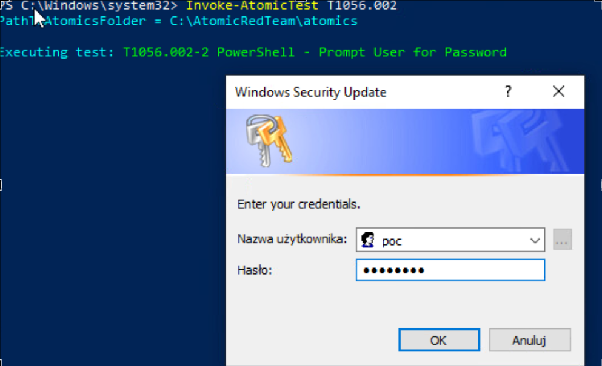
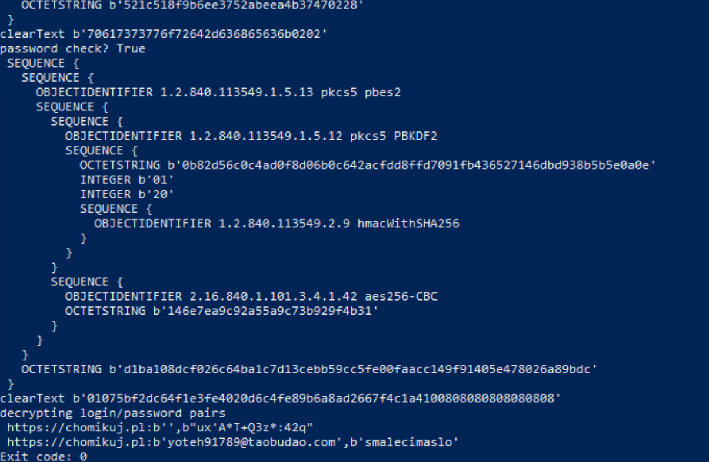

# Seminarium - MITRE ATT&CK Credential 

Dokument wykonany przez:
- Wojciech Hajduk 252988
- Dominik Hałubiec 253024

# Spis treści
1. [Credential Access](#ca)
    
    - [Definicja](#definicja)
    - [Techniki Credential Access](#techniki)
    - [Znaczenie znajomości technik Credential Access](#znaczenie)
    - [Obrona przed taktykami Credential Access](#obrona)

2. [Przygotowanie środowiska](#env)
3. [Proof of Concept](#poc)

    - [Brute Force](#poc1)
    - [Windows password prompt for update](#poc2)
    - [Firefox lasagne password dumping (SQL)](#poc3)
    - [Kubernetes List Secrets](#poc4)


<div id='ca'/>

# Credential Access


<div id='definicja'/>

# Definicja

Taktyka Credential Access w MITRE ATT&CK obejmuje operacje, w trakcie których atakujący uzyskują nieuprawniony dostęp do danych uwierzytelniających, takich jak hasła, klucze uwierzytelniające czy tokeny. Atakujący mogą wykorzystywać różne metody, takie jak przechwytywanie, pozyskiwanie z niezabezpieczonych źródeł, fałszowanie czy odzyskiwanie, aby zdobyć kontrolę nad kontami użytkowników, systemami czy aplikacjami. Celem ataków w ramach tej taktyki jest pozyskanie informacji, które umożliwią dalsze przemieszczanie się w środowisku i realizację celów atakującego.


<div id='techniki'/>

## Techniki Credential Access

### Adversary-in-the-Middle (T1557)

Technika Adversary-in-the-Middle (T1557) w MITRE ATT&CK opisuje sytuacje, w których atakujący umieszcza się między dwoma komunikującymi się podmiotami, aby przechwycić lub modyfikować przesyłane dane. Atak ten jest często stosowany w celu podsłuchiwania poufnych informacji, przechwytywania danych uwierzytelniających lub manipulowania transmisją w czasie rzeczywistym.

- **LLMNR/NBT-NS Poisoning and SMB Relay (T1557.001):**
  Atakujący wykorzystuje protokoły Link-Local Multicast Name Resolution (LLMNR) i NetBIOS Name Service (NBT-NS) w celu przechwycenia danych uwierzytelniających i przekazania ich dalej, wykorzystując atak SMB Relay.

- **ARP Cache Poisoning (T1557.002):**
  Atakujący modyfikuje pamięć cache protokołu ARP w celu przekierowania ruchu sieciowego przez własny system, umożliwiając przechwycenie danych lub przeprowadzenie ataków Man-in-the-Middle.

- **DHCP Spoofing (T1557.003):**
  Atakujący podszywa się pod serwer DHCP (Dynamic Host Configuration Protocol), przypisując klientom fałszywe konfiguracje sieciowe, co pozwala na przechwycenie lub manipulację ruchem sieciowym.

Ochrona przed Adversary-in-the-Middle obejmuje stosowanie szyfrowania end-to-end, monitorowanie ruchu sieciowego, regularne skanowanie pod kątem podatności oraz edukację pracowników w zakresie bezpieczeństwa komunikacji online.

### Brute Force (T1110)

Technika Brute Force (T1110) w MITRE ATT&CK polega na próbie odgadnięcia hasła poprzez wielokrotne, automatyczne próby logowania. Atakujący wykorzystują skrypty lub narzędzia do przetestowania różnych kombinacji haseł na koncie użytkownika, zwykle przy użyciu słowników, list popularnych haseł lub metod prób i błędów.

- **Password Guessing (T1110.001):**
  Atakujący próbują odgadnąć hasła, stosując różne metody, takie jak użycie słowników czy analiza informacji o użytkowniku.

- **Password Cracking (T1110.002):**
  Wykorzystanie technik złamywania haseł, takich jak ataki słownikowe, ataki brute force lub ataki oparte na rainbow table attacks.

- **Password Spraying (T1110.003):**
  Atakujący używają niewielkiej liczby haseł i testują je na wielu kontach, minimalizując ryzyko blokady konta z powodu licznych błędnych prób.

- **Credential Stuffing (T1110.004):**
  Wykorzystanie wcześniej skradzionych lub wyciekłych danych uwierzytelniających w celu dostępu do wielu kont, zakładając, że użytkownicy stosują te same dane w różnych miejscach.

Ochrona przed atakami Brute Force obejmuje zastosowanie silnych haseł, blokowanie kont po kilku nieudanych próbach logowania, monitorowanie nieprawidłowych aktywności i wdrażanie rozwiązań zapobiegających atakom tego typu.

### Credentials from Password Stores (T1555)

Technika Credentials from Password Stores (T1555) w MITRE ATT&CK odnosi się do prób atakujących pozyskania danych uwierzytelniających przechowywanych w magazynach haseł, zarządzanych centralnie lub lokalnie.

- **Keychain (T1555.001):**
  Atakujący próbują pozyskać dane uwierzytelniające przechowywane w systemowym magazynie haseł na platformie macOS, znanej jako Keychain.

- **Securityd Memory (T1555.002):**
  Wykorzystanie błędów w obszarze pamięci obsługującej bezpieczeństwo na platformie macOS (securityd) do pozyskania poufnych informacji, w tym danych uwierzytelniających.

- **Credentials from Web Browsers (T1555.003):**
  Poszukiwanie przechowywanych haseł w przeglądarkach internetowych, często przy użyciu narzędzi do wydobycia danych z plików przeglądarki.

- **Windows Credential Manager (T1555.004):**
  Atakujący próbują pozyskać dane uwierzytelniające przechowywane w Windows Credential Manager na systemach Windows.

- **Password Managers (T1555.005):**
  Atakujący kierują swoje działania na pozyskiwanie danych uwierzytelniających przechowywanych w popularnych menedżerach haseł.

- **Cloud Secrets Management Stores (T1555.006):**
  Próba pozyskania poufnych informacji, w tym danych uwierzytelniających, przechowywanych w chmurze, w systemach do zarządzania tajnymi danymi (secrets management stores).

Ochrona przed atakami na Credentials from Password Stores obejmuje zabezpieczanie magazynów haseł, stosowanie silnych haseł, monitorowanie ruchu w sieci, regularne szkolenia pracowników w zakresie bezpieczeństwa oraz wdrażanie metod dwuskładnikowego uwierzytelniania.


### Exploitation for Credential Access (T1212)

Technika Exploitation for Credential Access (T1212) w MITRE ATT&CK opisuje sytuacje, w których atakujący wykorzystuje podatności w systemach, aplikacjach lub usługach w celu uzyskania nieuprawnionego dostępu do danych uwierzytelniających.

Atakujący mogą posługiwać się różnymi metodami wykorzystywania podatności, aby zdobyć poufne informacje, takie jak hasła użytkowników czy klucze uwierzytelniające.

Ochrona przed Exploitation for Credential Access obejmuje regularne aktualizacje systemów, skanowanie pod kątem podatności, monitorowanie nieprawidłowej aktywności, stosowanie silnych haseł oraz edukację pracowników w zakresie bezpieczeństwa.


### Forced Authentication (T1187)

Technika Forced Authentication (T1187) w MITRE ATT&CK opisuje sytuacje, w których atakujący wymusza proces uwierzytelniania, zazwyczaj poprzez przymuszenie użytkownika do dostarczenia swoich danych uwierzytelniających.

Atakujący mogą wykorzystywać różne metody, takie jak fałszywe okna logowania, manipulacje procesu uwierzytelniania czy zmuszanie użytkowników do dostarczenia swoich danych pod pretekstem innych operacji.

Ochrona przed Forced Authentication obejmuje edukację pracowników w zakresie bezpieczeństwa, stosowanie rozwiązań antyphishingowych, monitorowanie aktywności uwierzytelniania oraz implementację silnych polityk bezpieczeństwa.

### Forge Web Credentials (T1606)

Technika Forge Web Credentials (T1606) w MITRE ATT&CK opisuje proces fałszowania danych uwierzytelniających w celu uzyskania dostępu do systemów lub zasobów online.

- **Web Cookies (T1606.001):**
  Atakujący próbują fałszować lub przechwytywać pliki cookie używane do uwierzytelniania na stronach internetowych, aby uzyskać dostęp do kont użytkowników.

- **SAML Tokens (T1606.002):**
  Atakujący próbują fałszować tokeny SAML (Security Assertion Markup Language), które są używane do jednokrotnego uwierzytelniania (SSO) i dostępu do zasobów online.

Ochrona przed Forge Web Credentials obejmuje szkolenie pracowników w zakresie bezpieczeństwa, stosowanie filtrów antyphishingowych, wdrażanie technologii szyfrowania i monitorowanie ruchu sieciowego.


### Input Capture (T1056)

Technika Input Capture (T1056) w MITRE ATT&CK opisuje metody przechwytywania danych wprowadzanych przez użytkownika na zainfekowanych systemach, co może prowadzić do uzyskania poufnych informacji, takich jak hasła czy inne dane uwierzytelniające.

- **Keylogging (T1056.001):**
  Atakujący stosują oprogramowanie keyloggerów do rejestrowania klawiszy naciskanych przez użytkownika, a tym samym przechwytują wprowadzane dane.

- **GUI Input Capture (T1056.002):**
  Przechwytywanie danych wprowadzanych przez użytkownika za pomocą interfejsu graficznego, obejmującego np. ekran komputera.

- **Web Portal Capture (T1056.003):**
  Rejestrowanie danych wprowadzanych na stronach internetowych, w tym formularzach logowania czy inne interakcje z portalami online.

- **Credential API Hooking (T1056.004):**
  Atakujący próbują przechwycić dane uwierzytelniające, wykorzystując hooki (zaczepy) w interfejsach programistycznych (API) odpowiedzialnych za przetwarzanie informacji uwierzytelniających.

Ochrona przed Input Capture obejmuje stosowanie rozwiązań antywirusowych, monitorowanie procesów systemowych, regularne aktualizacje oprogramowania oraz edukację pracowników w zakresie bezpieczeństwa.


### Modify Authentication Process (T1556)

Technika Modify Authentication Process (T1556) w MITRE ATT&CK opisuje sytuacje, w których atakujący dokonują zmian w procesie uwierzytelniania, w celu osiągnięcia dostępu do systemów lub zasobów.

- **Domain Controller Authentication (T1556.001):**
  Atakujący modyfikują proces uwierzytelniania w celu pozyskania dostępu do kontrolerów domeny i przechwycenia danych uwierzytelniających.

- **Password Filter DLL (T1556.002):**
  Wykorzystanie dynamicznie ładowanej biblioteki (DLL) do filtrowania i modyfikowania haseł podczas procesu uwierzytelniania.

- **Pluggable Authentication Modules (T1556.003):**
  Atakujący modyfikują pluggable authentication modules, co pozwala im na wprowadzanie zmian w procesie uwierzytelniania systemów Unix.

- **Network Device Authentication (T1556.004):**
  Modyfikacja procesu uwierzytelniania na urządzeniach sieciowych w celu przechwycenia danych uwierzytelniających.

- **Reversible Encryption (T1556.005):**
  Atakujący wykorzystują techniki umożliwiające przechwytywanie haseł w postaci, która może być łatwo odczytana (np. reversible encryption).

- **Multi-Factor Authentication (T1556.006):**
  Próba obejścia lub oszukania systemu wieloskładnikowego uwierzytelniania w celu zdobycia dostępu do konta.

- **Hybrid Identity (T1556.007):**
  Atakujący wykorzystują lukę w procesie uwierzytelniania, aby uzyskać dostęp do konta, łącząc ataki na różne elementy infrastruktury hybrydowej.

- **Network Provider DLL (T1556.008):**
  Modyfikacja dynamicznie ładowanej biblioteki (DLL) Network Provider w systemie Windows w celu przechwycenia danych uwierzytelniających.

Ochrona przed Modify Authentication Process obejmuje monitorowanie i audytowanie procesów uwierzytelniania, wdrażanie technologii zabezpieczających, takich jak dwuskładnikowe uwierzytelnianie, oraz regularne szkolenia pracowników w zakresie bezpieczeństwa.


### Multi-Factor Authentication Interception (T1111)

Technika Multi-Factor Authentication Interception (T1111) w MITRE ATT&CK opisuje sytuacje, w których atakujący próbują przechwycić dane niezbędne do obejścia lub oszukania systemu wielostopniowego uwierzytelnienia (MFA).

Atakujący mogą stosować różne metody, takie jak phishing, malware czy przechwytywanie komunikacji, aby uzyskać dostęp do danych uwierzytelniających potrzebnych do zalogowania się na konto zabezpieczone MFA.

Ochrona przed Multi-Factor Authentication Interception obejmuje stosowanie środków zapobiegawczych, takich jak monitoring ruchu sieciowego, edukacja pracowników w zakresie bezpieczeństwa, stosowanie technologii antyphishingowych oraz zabezpieczanie procesu uwierzytelniania.

### Multi-Factor Authentication Request Generation (T1621)

Technika Multi-Factor Authentication Request Generation (T1621) w MITRE ATT&CK opisuje sytuacje, w których atakujący próbują generować fałszywe żądania uwierzytelniania w celu oszukania systemów wielostopniowego uwierzytelnienia (MFA).

Atakujący mogą próbować obejść lub oszukać system MFA, generując żądania uwierzytelniania w celu uzyskania dostępu do zasobów lub kont.

Ochrona przed Multi-Factor Authentication Request Generation obejmuje weryfikację i monitorowanie żądań uwierzytelniania, stosowanie technologii antyphishingowych, wdrażanie środków bezpieczeństwa w procesie uwierzytelniania oraz regularne szkolenia pracowników w zakresie bezpieczeństwa.

### Network Sniffing (T1040)

Technika Network Sniffing (T1040) w MITRE ATT&CK opisuje sytuacje, w których atakujący przechwytują i analizują ruch sieciowy w celu pozyskania poufnych informacji, takich jak dane uwierzytelniające, klucze szyfrowania czy inne poufne dane.

Atakujący mogą stosować różne narzędzia i techniki do przechwytywania pakietów przesyłanych przez sieć w celu uzyskania informacji o działaniach użytkowników, a także danych, które mogą być użyte do dalszych ataków.

Ochrona przed Network Sniffing obejmuje stosowanie technologii szyfrowania ruchu sieciowego, monitorowanie nieprawidłowej aktywności, segmentację sieci, stosowanie protokołów bezpieczeństwa oraz regularne skanowanie pod kątem potencjalnych zagrożeń.

### OS Credential Dumping (T1003)

Technika OS Credential Dumping (T1003) w MITRE ATT&CK opisuje sytuacje, w których atakujący próbują pozyskać dane uwierzytelniające z systemu operacyjnego.

- **LSASS Memory (T1003.001):**
  Atakujący przechwytują informacje uwierzytelniające, takie jak hasła, znajdujące się w pamięci procesu Local Security Authority Subsystem Service (LSASS) na systemach Windows.

- **Security Account Manager (T1003.002):**
  Próba pozyskania danych uwierzytelniających przechowywanych w Security Account Manager (SAM) na systemach Windows.

- **NTDS (T1003.003):**
  Atakujący próbują pozyskać bazę danych Active Directory (NTDS.dit), która zawiera dane uwierzytelniające.

- **LSA Secrets (T1003.004):**
  Wykorzystanie błędów w obszarze pamięci Local Security Authority (LSA) w celu pozyskania danych uwierzytelniających na systemach Windows.

- **Cached Domain Credentials (T1003.005):**
  Próba pozyskania danych uwierzytelniających przechowywanych w pamięci podręcznej domeny na systemach Windows.

- **DCSync (T1003.006):**
  Wykorzystanie protokołu DRSUAPI w celu replikacji danych uwierzytelniających z kontrolera domeny na systemach Windows.

- **Proc Filesystem (T1003.007):**
  Atakujący uzyskują dostęp do systemu plików procfs w systemach UNIX-like w celu pozyskania informacji o procesach i danych uwierzytelniających.

- **/etc/passwd and /etc/shadow (T1003.008):**
  Próba pozyskania danych uwierzytelniających przechowywanych w plikach /etc/passwd i /etc/shadow na systemach UNIX-like.

Ochrona przed OS Credential Dumping obejmuje monitorowanie procesów, ograniczanie uprawnień użytkowników, stosowanie technologii szyfrowania, wdrażanie systemów detekcji anomalii oraz regularne skanowanie pod kątem podatności.

### Steal Application Access Token (T1528)

Technika Steal Application Access Token (T1528) w MITRE ATT&CK opisuje sytuacje, w których atakujący próbują pozyskać tokeny dostępu do aplikacji, które są używane do uwierzytelniania i uzyskania dostępu do zasobów.

Atakujący mogą wykorzystywać różne techniki, takie jak przechwytywanie komunikacji, ataki na procesy uwierzytelniania czy manipulacje w celu uzyskania dostępu do tokenów używanych przez aplikacje.

Ochrona przed Steal Application Access Token obejmuje stosowanie bezpiecznych protokołów komunikacyjnych, monitorowanie nieprawidłowej aktywności, stosowanie uwierzytelniania wieloczynnikowego oraz regularne skanowanie pod kątem potencjalnych zagrożeń.


### Steal or Forge Authentication Certificates (T1649)

Technika Steal or Forge Authentication Certificates (T1649) w MITRE ATT&CK opisuje sytuacje, w których atakujący próbują pozyskać lub sfałszować certyfikaty uwierzytelniające w celu oszukania systemów i uzyskania dostępu do zasobów.

Atakujący mogą wykorzystać różne metody, takie jak kradzież prywatnych kluczy certyfikatów, ataki na procesy uwierzytelniania czy próby fałszowania certyfikatów w celu uzyskania nieuprawnionego dostępu.

Ochrona przed Steal or Forge Authentication Certificates obejmuje wdrażanie bezpiecznych praktyk zarządzania certyfikatami, monitorowanie procesów uwierzytalniania, stosowanie szyfrowania end-to-end oraz regularne skanowanie pod kątem potencjalnych zagrożeń.


### Steal or Forge Kerberos Tickets (T1558)

Technika Steal or Forge Kerberos Tickets (T1558) w MITRE ATT&CK opisuje sytuacje, w których atakujący próbują pozyskać lub sfałszować bilety Kerberos w celu oszukania systemów uwierzytelniania i uzyskania dostępu do zasobów.

- **Golden Ticket (T1558.001):**
  Atakujący używają długo ważnych biletów Kerberos (TGTs), zwanych "Golden Tickets", które umożliwiają dostęp do dowolnych zasobów w danym środowisku.

- **Silver Ticket (T1558.002):**
  Wykorzystanie sfałszowanych biletów Kerberos, tzw. "Silver Tickets", które pozwalają na dostęp tylko do określonych zasobów.

- **Kerberoasting (T1558.003):**
  Atakujący przechwytują tzw. ticket granting ticket (TGT) w celu ich dalszego złamania i uzyskania haseł użytkowników.

- **AS-REP Roasting (T1558.004):**
  Atakujący wykorzystują błędy w procesie uwierzytelniania Kerberos, zwane "AS-REP Roasting", do uzyskania haseł użytkowników bez ich rzeczywistego logowania.

Ochrona przed Steal or Forge Kerberos Tickets obejmuje monitorowanie ruchu sieciowego, stosowanie technologii detekcji anomalii, ograniczanie uprawnień użytkowników, stosowanie zabezpieczeń w procesie uwierzytelniania oraz regularne szkolenia pracowników w zakresie bezpieczeństwa.

### Steal Web Session Cookie (T1539)

Technika Steal Web Session Cookie (T1539) w MITRE ATT&CK opisuje sytuacje, w których atakujący próbują pozyskać pliki cookie sesji używane w trakcie interakcji użytkownika z aplikacjami webowymi.

Atakujący mogą wykorzystywać różne techniki, takie jak przechwytywanie komunikacji, ataki na aplikacje webowe czy używanie złośliwego oprogramowania, aby uzyskać dostęp do plików cookie sesji i podszyć się pod zalogowanego użytkownika.

Ochrona przed Steal Web Session Cookie obejmuje stosowanie bezpiecznych protokołów komunikacyjnych (HTTPS), regularne skanowanie aplikacji webowych pod kątem podatności, monitorowanie ruchu sieciowego oraz edukację pracowników w zakresie bezpieczeństwa.


### Unsecured Credentials (T1552)

Technika Unsecured Credentials (T1552) w MITRE ATT&CK opisuje sytuacje, w których atakujący próbują pozyskać niezabezpieczone dane uwierzytelniające, takie jak hasła, klucze prywatne czy inne poufne informacje.

- **Credentials In Files (T1552.001):**
  Atakujący szukają niezabezpieczonych plików zawierających dane uwierzytelniające, takie jak pliki konfiguracyjne czy pliki tekstowe.

- **Credentials in Registry (T1552.002):**
  Próba pozyskania danych uwierzytelniających z rejestru systemowego, gdzie mogą być przechowywane wrażliwe informacje.

- **Bash History (T1552.003):**
  Atakujący szukają w historii poleceń w powłoce Bash na systemach Unix-like, aby uzyskać informacje o wcześniejszych operacjach.

- **Private Keys (T1552.004):**
  Próba pozyskania kluczy prywatnych używanych do szyfrowania danych czy uwierzytelniania.

- **Cloud Instance Metadata API (T1552.005):**
  Atakujący próbują uzyskać dostęp do danych uwierzytelniających z metadanych instancji w chmurze, takich jak AWS Metadata API.

- **Group Policy Preferences (T1552.006):**
  Poszukiwanie niezabezpieczonych informacji uwierzytelniających przechowywanych w preferencjach grupy (Group Policy Preferences) w środowisku Windows.

- **Container API (T1552.007):**
  Atakujący próbują uzyskać dostęp do danych uwierzytelniających z API kontenerów, takich jak Docker API.

- **Chat Messages (T1552.008):**
  Poszukiwanie informacji uwierzytelniających w wiadomościach czatów, takich jak Slack czy Microsoft Teams.

Ochrona przed Unsecured Credentials obejmuje stosowanie silnych polityk zarządzania dostępem, szyfrowanie poufnych danych, monitorowanie nieprawidłowej aktywności oraz regularne skanowanie pod kątem potencjalnych zagrożeń.


<div id='znaczenie'/>

## Znaczenie znajomości technik Credential Access

Taktyka Credential Access pełni kluczową rolę w świecie cyberbezpieczeństwa, wpływając istotnie na sposób, w jaki organizacje monitorują i reagują na potencjalne zagrożenia. Zrozumienie jej znaczenia jest kluczowe dla efektywnej ochrony przed cyberatakami.

### Punkt Zwrotny w Cyklu Ataku

Credential Access stanowi punkt zwrotny w cyklu ataku. Gdy przeciwnik uzyskuje początkowy dostęp do systemu, zdobycie poświadczeń staje się naturalnym krokiem. Zabezpieczanie i monitorowanie punktów dostępu do poświadczeń umożliwia skuteczną obronę i przeciwdziałanie rozwijającemu się atakowi.

### Podwyższenie Dostępu

Z ukradzionymi poświadczeniami atakujący mogą podnieść się z roli użytkownika o niskich uprawnieniach na użytkownika o wysokich uprawnieniach. To umożliwia im podejmowanie bardziej zaawansowanych działań w sieci, zwiększając potencjalne szkody.

### Skradzione Poświadczenia

Korzystanie z prawidłowych poświadczeń pozwala atakującym na ukrycie się w tłumie zwykłych użytkowników, co sprawia, że są trudniejsi do wykrycia przez systemy monitoringu.

### Ominiecie Tradycyjnych Obron

Atakujący, dysponując ważnymi poświadczeniami, może unikać wykrycia lub zablokowania przez tradycyjne środki obronne, takie jak firewalle czy systemy zapobiegania intruzom.

### Ułatwia Ruch Lateralny

Skradzione poświadczenia umożliwiają atakującym swobodne poruszanie się po sieci, zdobywanie dostępu do różnych systemów i repozytoriów danych. Ten ruch lateralny zwiększa skutki potencjalnego ataku.

### Trwałość

Uzyskiwanie i wykorzystywanie wielu zestawów poświadczeń pozwala przeciwnikom utrzymać dostęp do skompromitowanego środowiska nawet po wykryciu i unieważnieniu jednego zestawu ukradzionych poświadczeń.

### Kosztowna Odbudowa

Po ukradzeniu poświadczeń, zwłaszcza w dużych środowiskach, naprawa może być skomplikowana i kosztowna. Obejmuje to resetowanie haseł w całej organizacji, dochodzenie w zakresie nieuprawnionego dostępu, a nawet odbudowę systemów.

### Umożliwia Dalsze Ataki

Skradzione poświadczenia stają się narzędziem do przeprowadzania kolejnych ataków, zarówno wobec tej samej organizacji w przyszłości, jak i wobec innych podmiotów, gdzie użytkownicy mogą ponownie używać tych samych haseł.

### Wartość na Czarnym Rynku

Poświadczenia, zwłaszcza te dotyczące ważnych celów czy systemów, mogą być przedmiotem sprzedaży lub udostępniania na rynkach nielegalnych, zwiększając rozprzestrzenianie się nieuprawnionego dostępu i potencjalnych naruszeń.

Z uwagi na te kluczowe aspekty, techniki związane z taktyką "Dostęp do poświadczeń" są niezwykle istotne dla skutecznej obrony organizacji przed cyberatakami.


<div id='obrona'/>

## Obrona przed taktykami Credential Access

Poniżej znajduje się podsumowanie metod obrony, które pozwalają znacznie zminimalizować ryzykow wystąpienia ataków Credential Access:

### Zasady Silnych Haseł:
- Wymuszanie używania trudnych haseł.
- Używanie haseł frazowych, które są dłuższe i często łatwiejsze do zapamiętania niż hasła.
- Ustawianie rozsądnego maksymalnego wieku hasła, aby zapewnić regularną zmianę haseł.
- Zapobieganie ponownemu użyciu poprzednich haseł.

### Autoryzacja Dwuetapowa (2FA):
- Wdrożenie 2FA dla wszystkich systemów krytycznych, zwłaszcza dla zdalnego dostępu i działań administracyjnych.

### Ochrona Kontrolerów Domeny i Serwerów Autoryzacji:
- Zabezpieczanie kluczowych zasobów, korzystając z najlepszych praktyk.
- Regularne monitorowanie i przeprowadzanie audytów ich zabezpieczeń.

### Ograniczanie Użycia Kont Z Uprawnieniami:
- Stosowanie zasady najmniejszych uprawnień (PoLP). Użytkownicy powinni mieć tylko te uprawnienia, które są niezbędne do wykonywania ich zadań.
- Unikanie używania kont admina domeny do rutynowych zadań. Zamiast tego, używanie oddzielnych kont do administracji.

### Bezpieczne Przechowywanie Poświadczeń:
- Nie przechowywanie haseł w tekście jawnym.
- Upewnianie się, że oprogramowanie i usługi haszują i solą hasła.

### Regularne Monitorowanie i Audyt Dzienników:
- Sprawdzanie nieudanych prób logowania lub dostępu z nietypowych lokalizacji.
- Stosowanie narzędzi takich jak systemy Security Information and Event Management (SIEM) mogą pomóc zautomatyzować ten proces.

### Ochrona Poświadczeń:
- W środowiskach Windows używanie funkcji takich jak Windows Defender Credential Guard do ochrony skrótów haseł NTLM i biletów do uzyskiwania biletów Kerberos.

### Szkolenie i Świadomość:
- Edukowanie użytkowników na temat zagrożeń phishingu, ponieważ jest to powszechna metoda, jakiej używają atakujący do kradzieży poświadczeń.
- Zachęcanie użytkowników do zgłaszania podejrzanych działań lub wiadomości.

### Ograniczanie Narażenia:
- Redukcja liczby miejsc, w których przechowywane są lub przesyłane poświadczenia.
- Wyłączanie lub ograniczanie protokołów znanych z przesyłania poświadczeń w tekście jawnym, takich jak Telnet czy FTP.

### Bezpieczne Stanowiska Robocze:
- Używanie rozwiązań ochrony punktów końcowych do wykrywania i zapobiegania złośliwemu oprogramowaniu, zwłaszcza keyloggerom lub dumpom pamięci.
- Regularne aktualizowanie i łatanie systemów.

### Segmentacja Sieci:
- Oddzielanie wrażliwych systemów lub danych od szerszej sieci, ograniczanie dostępu, który skompromitowane konto mogłoby mieć.

### Ochrona Ciasteczek Sesji:
- Używanie flag "Secure" i "HttpOnly" dla ciasteczek.
- Upewnianie się, że aplikacje internetowe stosują silne zarządzanie sesjami.

### Menadżery Haseł:
- Zachęcanie do używania menadżerów haseł. Narzędzia te generują i przechowują trudne hasła, zmniejszając prawdopodobieństwo stosowania słabych lub powtarzających się haseł.

### Polityki Blokady Kont:
- Wprowadzanie polityk blokady kont, aby zniechęcić ataki typu brute-force. Jednak bądź świadomy ryzyka ataków typu odmowa usługi (DoS).

### Regularne Audytowanie Kont:
- Okresowe przeglądanie wszystkich kont i dezaktywowanie tych, które nie są już potrzebne.
- Szukanie anomalii, takich jak konta z niepotrzebnymi uprawnieniami.


<div id='env'/>

# Przygotowanie środowiska

Pobraliśmy framework **Atomic** na system Windows z ich repozytorium za pomocą poniższej komendy:
```powershell
IEX (IWR 'https://raw.githubusercontent.com/redcanaryco/invoke-atomicredteam/master/install-atomicredteam.ps1' -UseBasicParsing);
```

Początkowo mieliśmy problem z działaniem tej komendy. W celu naprawienia wpisaliśmy:
```powershell
Set-ExecutionPolicy RemoteSigned
```

<div id='poc'/>

# Proof of Concept

Poniżej zaprezentowano wykonanie Proof of Concept kilku wybranych przez nas technik

<div id='poc1'/>

## Brute Force

> T1110.001 - Brute Force: Password Guessing

Test przeprowadzono na maszynie wirtualnej z systemem Kali Linux.

Przeprowadzono prosty atak Brute Force przy pomocy narzędzia `Hydra` na sąsiadnią maszynę wirtualną, która również znajduje się w tej samej sieci

```bash
hydra -l root -P /usr/share/wordlists/metasploit/unix_passwords.txt -t 6 ssh://10.0.0.102
```


W narzędziu `Wazuh` zaobserwowany próbę wykonania ataku:



<div id='poc2'/>

## Windows password prompt for update

> T1056.002: GUI Input Capture

Pobraliśmy potrzebne do wykonania Proof of Concept komponenty za pomogą flagi `-GetPrereq`:
```powershell
Invoke-AtomicTest T1056.002 -GetPrereq
```

Uruchomienie Proof of Concept:
```powershell
Invoke-AtomicTest T1056.002
```



<div id='poc3'/>

## Firefox lasagne password dumping (SQL)

> T1056.002: GUI Input Capture

Pobraliśmy potrzebne do wykonania Proof of Concept komponenty za pomogą flagi `-GetPrereq`. Flaga 6 oraz 8 mówi o wykonaniu ataku konkretnie na przeglądarke Firefox oraz późniejsze uruchomienie skryptu, który pozwoli odczytać i bazę SQL z hasłami:
```powershell
Invoke-AtomicTest T1555.003-6,8 -GetPrereq
```

Uruchomienie Proof of Concept:
```powershell
Invoke-AtomicTest T1555.003-6,8
```



<div id='poc4'/>

## Kubernetes List Secrets

> T1552.007 - Unsecured Credentials.Container API

## Przygotowanie

Na początku utworzono dwa namespace'y:
```bash
$ kubectl create ns public
namespace/public created

$ kubectl create ns protected
namespace/protected created
```

Przy pomocy komendy `kubectl apply -f <nazwa_pliku>` utworzono dwa secrety.

```yaml
apiVersion: v1
kind: Secret
metadata:
  name: public-secret
  namespace: public
type: Opaque
data:
  password: cHVibGljIHBhc3N3b3Jk
```

```yaml
apiVersion: v1
kind: Secret
metadata:
  name: protected-secret
  namespace: protected
type: Opaque
data:
  password: cHJvdGVjdGVkIHBhc3N3b3Jk
```

Utworzono też dodatkowego użytkownika:

```bash
$ openssl genrsa -out dominik.key 2048

$ openssl req -new -key dominik.key -out dominik.csr -subj /CN=dominik/O=group1

$ openssl x509 -req -in dominik.csr -CA ~/.minikube/ca.crt -CAkey ~/.minikube/ca.key -CAcreateserial -out dominik.crt -days 500
Certificate request self-signature ok
subject=CN = dominik, O = group1

$ kubectl config set-credentials dominik --client-certificate=dominik.crt --client-key=dominik.key
User "dominik" set.

$ kubectl config set-context dominik-context --cluster=minikube --user=dominik
Context "dominik-context" created.
```

## Testy Atomics

Przy domyślnych ustawieniach clustra możliwe jest wyświetlenie kubernetesowych secretów we wszystkich namespacach

```bash
$ kubectl get secret --all-namespaces
NAMESPACE     NAME                     TYPE                            DATA   AGE
kube-system   bootstrap-token-zcuyxp   bootstrap.kubernetes.io/token   6      3d5h
protected     protected-secret         Opaque                          1      10s
public        public-secret            Opaque                          1      6s

```

Oraz w namespacach, które sugerowałyby, że powinny być zabezpieczone

```bash
$ kubectl get secret -n protected
NAME               TYPE     DATA   AGE
protected-secret   Opaque   1      62s
```

Możliwe jest również podejrzenie zawartości plików wewnątrz działających podów:

```bash
$ kubectl exec atomic-pod -- cat /run/secrets/kubernetes.io/serviceaccount/token
eyJhbGciOiJSUzI1NiIsImtpZCI6Ilo0cGFKVlRUV1E5aFFNMkUxeEVTWEh6RU9VYnY1d2F4a2xMdnc2cDNFQncifQ.eyJhdWQiOlsiaHR0cHM6Ly9rdWJlcm5ldGVzLmRlZmF1bHQuc3ZjLmNsdXN0ZXIubG9jYWwiXSwiZXhwIjoxNzM2OTcwMzk4LCJpYXQiOjE3MDU0MzQzOTgsImlzcyI6Imh0dHBzOi8va3ViZXJuZXRlcy5kZWZhdWx0LnN2Yy5jbHVzdGVyLmxvY2FsIiwia3ViZXJuZXRlcy5pbyI6eyJuYW1lc3BhY2UiOiJkZWZhdWx0IiwicG9kIjp7Im5hbWUiOiJhdG9taWMtcG9kIiwidWlkIjoiNTNmZDgxYzYtNTU4My00NWQ0LWFlZDktMDliNzM2NTk5NDIyIn0sInNlcnZpY2VhY2NvdW50Ijp7Im5hbWUiOiJkZWZhdWx0IiwidWlkIjoiYzU3NDIwMjMtOGRiNi00M2FiLWE4NjMtYTY4ZjYzMGRjN2RjIn0sIndhcm5hZnRlciI6MTcwNTQzODAwNX0sIm5iZiI6MTcwNTQzNDM5OCwic3ViIjoic3lzdGVtOnNlcnZpY2VhY2NvdW50OmRlZmF1bHQ6ZGVmYXVsdCJ9.BTV3KMZxoz8fnS-7283IdHpMEDXQwDlvyx97_iKMXepUYek01YE1hadva7YNrml7q3S99Gx7IGAxKQ_OKnQrxV9dxE5hDxwwq2NTk4HRNhcFypZ9HV4-hiLefMBVhKycTQ2Vo1K2yCFCNG-DRYd4qS2hTaRq0lMNIZHgR9PJXm6zOR_Qjq2sW8tXSW6IPjs8tLmXmntmYE4olghNIgfMPrOFY2aM6vD1V-i4VxzxP5rc0cPHPwLx5W1WrX0CuDJGDtttPzMsttpIw8MUOpDVdWx9lOA0fjLxo-72aS2uLnzswO9-28--NO86wuotwYlKUkGp4WL_eFr831RO1eRPCQ
```

## Zabezpieczenie środowiska

W celu poprawy bezpieczeństwa zastosowano RBAC w clustrze kubernetesowym.

Utworzono rolę i przypisaną ją do użytkownika `dominik`:

```yaml
apiVersion: rbac.authorization.k8s.io/v1
kind: Role
metadata:
  namespace: public
  name: secrets-access-role
rules:
- apiGroups: [""]
  resources: ["secrets"]
  verbs: ["get", "list"]
```

```yaml
apiVersion: rbac.authorization.k8s.io/v1
kind: RoleBinding
metadata:
  name: secrets-access-binding
  namespace: public
subjects:
- kind: User
  name: "dominik"
  apiGroup: rbac.authorization.k8s.io
roleRef:
  kind: Role
  name: secrets-access-role
  apiGroup: rbac.authorization.k8s.io
```

Rola ta sprawia, że możliwe jest wyświetlanie secretów tylko w namespacie public

```bash
$ kubectl get secret -n public
NAME            TYPE     DATA   AGE
public-secret   Opaque   1      16m
```

```bash
$ kubectl get secret -n protected
Error from server (Forbidden): secrets is forbidden: User "dominik" cannot list resource "secrets" in API group "" in the namespace "protected"
```

Użytkownik `dominik` nie może również wykonać poleceń wewnątrz podów

```bash
$ kubectl exec atomic-pod -- cat /run/secrets/kubernetes.io/serviceaccount/token
Error from server (Forbidden): pods "atomic-pod" is forbidden: User "dominik" cannot get resource "pods" in API group "" in the namespace "default"
```